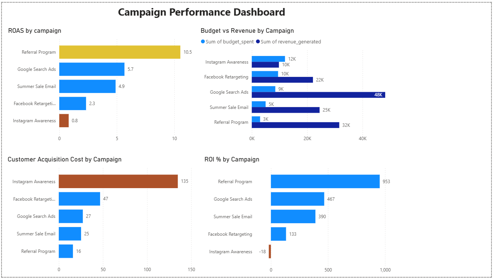
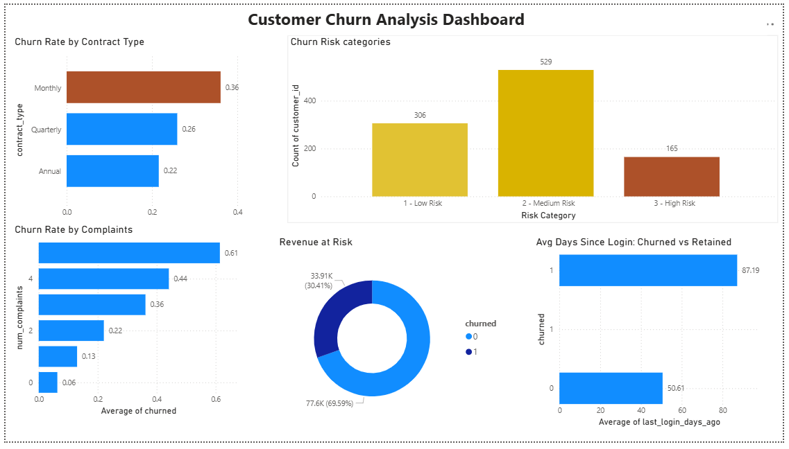

# 📊 Raizo Vision | Marketing Strategy & Data Analytics

### MSc Marketing | Published Metaverse Researcher | Python (Pandas) | Financial ROI 

I am a **Marketing Strategy & Data professional** bridging the gap between academic research, technical data science, and cold, hard financial profit. Currently based in Budapest, I specialize in emerging digital ecosystems and data-driven performance metrics.

---

## 🚀 The "Triple-Threat" Profile

- **Academic Rigor:** 2x Published Author focusing on **Metaverse Advertising & Consumer Engagement**. I bring peer-reviewed analytical thinking to evolving digital landscapes.
- **Technical Edge:** Leveraging **Python (Pandas)** to automate performance marketing workflows and replace manual reporting with scalable code.
- **Financial Literacy:** Expert in connecting marketing spend to the balance sheet via **CAC, LTV, and P&L analysis**.

---

## 🛠️ Technical Toolkit
- **Data:** Python (Pandas, NumPy), Power BI, SQL (In Progress), Excel.
- **Strategy:** Metaverse Marketing Strategy, Immersive Ad Tech, Performance Analytics.
- **Finance:** ROI Optimization, Budget Forecasting, Accounting Principles for Marketers.

---

## 📚 Featured Publications
- **"Interactive and Immersive Advertising in the Metaverse: User Perceptions and Engagement Compared to Traditional Online Environments"**
  - *Strategic analysis of user behavior shifts in 3D environments vs. legacy digital channels.*
- **"Enhanced Marketing Strategies in the Metaverse: Opportunities and Challenges"**
  - *Framework for identifying growth opportunities and navigating risks in emerging immersive markets.*

---

## 📈 2026 "Build in Public" Projects
### Project 1 — Customer Segmentation Dashboard ✔️
**Tools:** Python (Pandas, NumPy) · Power BI  
**Dataset:** 1,000 e-commerce customers  

**What I built:**
- Cleaned and explored a marketing dataset in Python
- Segmented customers into 4 groups: Champion, At Risk, Potential, Lost
- Exported data to Power BI and built an interactive dashboard

**Key insight:** At-risk customers have the highest average spend ($436) —
making them the #1 priority for re-engagement campaigns.

---

### Project 2 — Campaign Performance Tracker ✔️
**Tools:** Python (Pandas, NumPy) · Power BI  
**Dataset:** 5 marketing campaigns across channels

**What I built:**
- Calculated ROAS, CAC, ROI%, Conversion Rate for each campaign
- Identified the campaign losing money despite the biggest budget
- Built a 4-visual Power BI dashboard comparing all campaigns

**Key insight:** Instagram had the highest budget ($12K) but the only 
negative ROI (-18%). Referral Program spent $3K and returned 953% ROI.

---

### Project 3 — Customer Churn Analysis ✔️
**Tools:** Python (Pandas, NumPy) · Power BI
**Dataset:** 1,000 customers with behavioral data

**What I built:**
- Built a churn scoring model based on 6 behavioral signals
- Categorized customers into Low, Medium and High risk groups
- Calculated $33,908 monthly revenue at risk
- Built a 5-visual Power BI dashboard

**Key insight:** Complaints are the strongest churn signal — 
zero complaints = 6.3% churn risk, 5 complaints = 61% churn risk.

---
### Project 4 — Marketing Channel Performance Analysis ✔️

**Tools:** Google BigQuery (SQL) · Python (Pandas) · Power BI
**Dataset:** Google Analytics Sample — Real e-commerce data (July 2017)

**What I built:**
- Wrote SQL queries on Google BigQuery to extract channel performance and 31-day daily trend data
- Processed and derived metrics in Python: conversion rate, revenue per session, 7-day rolling average
- Built a 4-visual Power BI dashboard: revenue by channel, daily trend, conversion rate, KPI cards

Key insight: Direct traffic drove 99.9% of revenue — strong brand awareness but dangerous channel dependency. July 5th showed a 5x session spike revealing a hidden promotional event in the data.

→ Full project: https://github.com/thisisRaizo/RaizoVision/tree/main/Project-3-Marketing-Channel-Analysis
---

## 🌍 Legal Status & Mobility (2026 Ready)
As an EU-based Master’s graduate, I am highly qualified for the **EU Blue Card 2026** pathway. I am ready to relocate for impactful opportunities in **Germany, the Netherlands, Poland, or Hungary.**

- **LinkedIn:** [linkedin.com/in/akbarsoltani](https://www.linkedin.com/in/akbarsoltani)
- **X (Twitter):** [@RaizoVision](https://x.com/RaizoVision)

*"Seeing the patterns others miss."*
